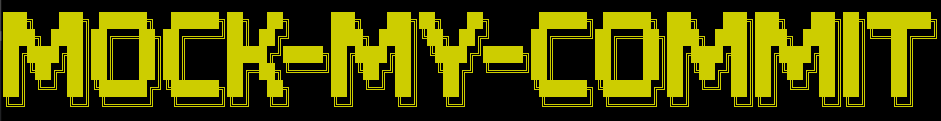
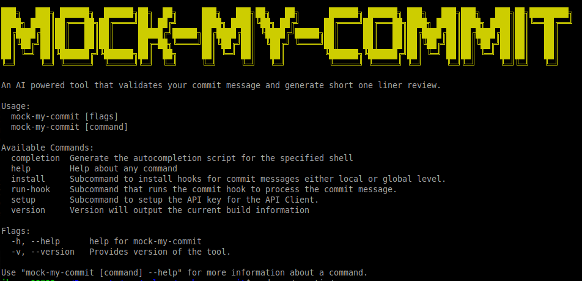
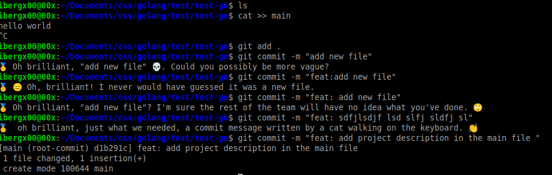
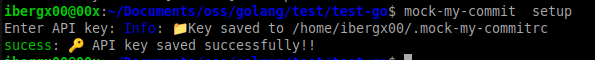
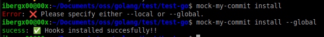
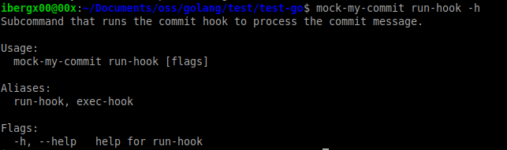
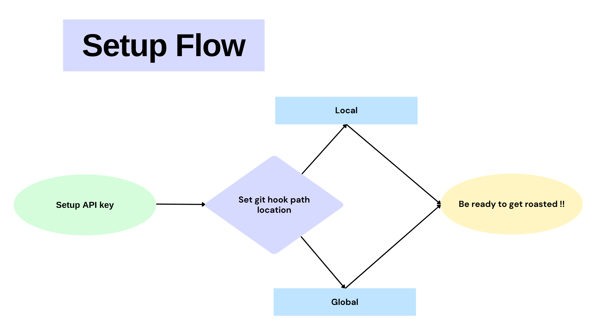

<p align="center">

</p>

Introducing **mock-my-commit** tool because your 'fixed stuff' commit messages clearly needed a reality check. Powered by the Mistral text generation model API, this tool ensures that no matter how lazy your commits are, you'll get the judgment you deserve🤐.

---

### Installation

> Required

- **Go (version 1.22 or higher):** [Go installation guide](https://go.dev/doc/install)
- **Mistral API Key:** [Mistral API Keys console](https://console.mistral.ai/api-keys/)

<details>
  <summary>For Linux OS</summary>

  ```bash
  go install github.com/Kshitiz-Mhto/mock-my-commit@latest
  ```
</details>

<details>
  <summary>For Mac OS</summary>

  ```bash
  go install github.com/Kshitiz-Mhto/mock-my-commit@latest
  ```
</details>


<details>
  <summary>For Windows OS</summary>

  ```bash
  go install github.com/Kshitiz-Mhto/mock-my-commit@latest
  ```
</details>


---

### Features

- **Automated Validation**: Enforces Git commit message best practices before commits are registered.

- **Cross-Platform Support**:  Supports **Linux**, **Mac** and **Windows** integration.

- **Sarcastic Reviews**: Generates passive-aggressive feedback using Mistral's API for poorly crafted messages.

- **Seamless Integration**: Functions as a Git `commit-msg` hook to validate messages within your existing workflow.

---

### Project: mock-my-commit

This project, `mock-my-commit`, is built using the Go programming language. Below is a list of the commands offered by this tool.

<p align="center">
  
</p>

> *Demo*

<p align="center">
  
</p>

---

### *Brief Command Screenshot*

> *setup-API-key*

<p align="center">
  
</p>

> *install*

<p align="center">
  " width="800">
</p>

> *run-hook*

<p align="center">
  
</p>

---

## Technologies Used

- [cobra](https://github.com/spf13/cobra) – CLI framework for handling commands.
- [term](https://golang.org/x/term) – Terminal handling utilities.
- [emoji](https://github.com/enescakir/emoji) – For adding emoji reactions to roasts.
- [terminfo](https://github.com/xo/terminfo) – Terminal capabilities information.
- [mistral-go](https://github.com/gage-technologies/mistral-go) – API client for interacting with the Mistral text generation model.
- [gookit/color](https://github.com/gookit/color) – Colored terminal output.

---

### Flowchart

> *setup flow-diagram*

<p align="center">
  
</p>

---

## Local setup

<details>
  <summary>setup for Linux OS</summary>

  ### Prerequisites
  
  - **Go (version 1.22 or higher):** [Go installation guide](https://go.dev/doc/install).
  - **Make:** Install using (e.g., `sudo apt-get install make` on Debian/Ubuntu).
  - **Mistral API Key:** [Mistral API Keys console](https://console.mistral.ai/api-keys/).

  ### Installation

  1. Navigate to the project repo and run 

  ```bash
  make build
  ```

  2. Create a symlink using 

  ```bash
  sudo ln -s /path/to/bin/mock-my-commit /usr/local/bin/mock-my-commit
  ```

  3. Test the Executable

  ```bash
  mock-my-commit
  ```

  4. View the Manual

  ```bash
  mock-my-commit -h
  ```
</details>

<details>
  <summary>Setup for macOS</summary>

  ### Prerequisites
  
  - **Go (version 1.22 or higher)**: Install via [Homebrew](https://brew.sh/) (`brew install go`) or [official package](https://go.dev/doc/install)
  - **Make**: Pre-installed with Xcode Command Line Tools (run `xcode-select --install` if missing)
  - **Mistral API Key**: [Get from Mistral console](https://console.mistral.ai/api-keys/)

  ### Installation

  1. **Build the binary**  
     ```bash
     make build
     ```
     *For M1/M2 Macs: Ensure Rosetta isn't interfering with ARM builds*

  2. **Create system symlink**  
     ```bash
     sudo ln -s $HOME/path/to/project/bin/mock-my-commit /usr/local/bin/mock-my-commit
     ```

  ### Verification
  ```bash
  mock-my-commit --version  # Check installation
  mock-my-commit -h         # View manual
  ```

</details>

<details>
  <summary>setup for Window OS</summary>

  ### Prerequisites
  
  - **Go (version 1.22 or higher):** [Go installation guide](https://go.dev/doc/install)
  - **Mistral API Key:** [Mistral API Keys console](https://console.mistral.ai/api-keys/)

  ### Installation

  1. **Build the Project**  
     Open Command Prompt/PowerShell in the project directory and run:
     ```bash
     go build -o bin/mock-my-commit.exe main.go
     ```

  2. **Add to System PATH**  
     Either:
     - Move the `bin/mock-my-commit.exe` to a directory already in your PATH, **or**

     - Create a symlink using:

       ```powershell
       # PowerShell (Admin)
       New-Item -ItemType SymbolicLink -Path "$env:SYSTEMROOT\System32\mock-my-commit.exe" -Target "C:\full\path\to\bin\mock-my-commit.exe"
       ```

       ```cmd
       :: Command Prompt (Admin)
       mklink "%SYSTEMROOT%\System32\mock-my-commit.exe" "C:\full\path\to\bin\mock-my-commit.exe"
       ```
  3. **Test the Executable**
     ```bash
     mock-my-commit
     ```

  4. **View the Manual**
     ```bash
     mock-my-commit -h
     ```

  > **Note:** 

  > - For symlinks, run PowerShell or Command Prompt as Administrator
  > - Replace `C:\full\path\to\bin` with your actual binary path
  > - `$env:SYSTEMROOT`/`%SYSTEMROOT%` automatically resolves to `C:\Windows` (or system root)

</details>

---

## Makefile Documentation  

This `Makefile` simplifies building, testing, installing, and cleaning the **mock-my-commit** project.  

### Variables  
- **BINARY_NAME**: Output binary name (`mock-my-commit`).  
- **OUTPUT_DIR**: Directory for the built binary (`bin`).  
- **MAIN_FILE**: Entry point of the Go project (`./main.go`).  
- **INSTALL_DIR**: Installation path (`$GOBIN` or `$HOME/go/bin`).  

### Targets

The Makefile has the following targets that automate the build process:

#### `build`

- **Description**: Builds the binary from the main Go file and outputs it to the `bin` directory.

```bash
make build
```

#### `test`

- **Description**: Runs the tests for the project using `go test`.

```bash
make test
```

### `install`

- **Description**: Builds the project and installs the binary to the `GOBIN` directory.

```bash
make install
```

### `clean`

  ```bash
  make clean
  ```
